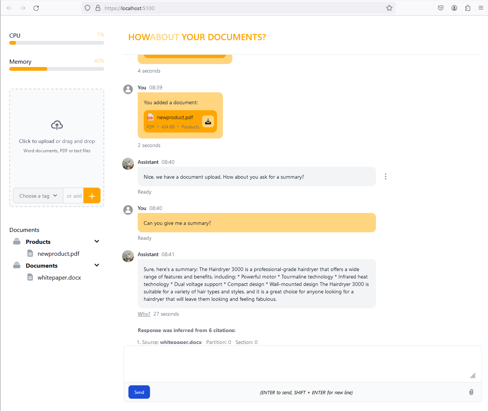

Answers questions about your documents with large language models. Proof of concept, testing.

#### Chat about the contents of your documents




### How to install

- [Install on Linux](doc/how_to/01_install_on_linux.md)], Ubuntu, Debian, CentOS, Fedora, RHEL, etc.
- [Install on macOS](doc/how_to/02_install_on_macos.md)] and OSX for Apple Silicon and Intel Macs.
- [Install on Windows](doc/how_to/03_install_on_windows.md), 32-bit, 64-bit, ARM, etc.
- [Install on Raspberry Pi](doc/how_to/04_install_on_raspberry.md)]

- [Install on Docker](doc/how_to/05_install_on_docker.md)], Docker Compose, Podman, etc.
- [Install on Kubernetes](doc/how_to/06_install_on_kubernetes.md)], Minikube, MicroK8s, with Helm, etc.

- [Install on Microsoft Azure](doc/how_to/07_install_on_azure.md)], App Services, AKS, Azure Container Instances, etc.
- [Install on Amazon AWS](doc/how_to/08_install_on_aws.md)]
- [Install on Google Cloud](doc/how_to/09_install_on_google_cloud.md)]
- [Install on Salesforce Heroku](doc/how_to/10_install_on_heroku.md)]


### How to build yourself

- [Build and run with Visual Studio IDE](doc/how_to/20_build_with_visual_studio_ide.md)
- [Build and run with Visual Studio Code](doc/how_to/21_build_with_visual_studio_code.md)
- [Build and run with JetBrains Rider](doc/how_to/22_build_with_rider.md)
- [Build and run with dotnet-cli](doc/how_to/23_build_with_dotnet_cli.md)]
- [Build and run with dotnet-sdk and Docker](doc/how_to/24_build_with_docker.md))


### How to configure

When you run Howabout for the first time, you'll need to configure a language model. Here's how.

- [Configure appsettings.json](doc/how_to/30_configure_appsettings.md) and environment variables.
- [Choosing language models](doc/how_to/31_choosing_language_models.md)


### How to use

- [Use command line](doc/how_to/40_use_command_line.md)
- [Use web browser](doc/how_to/41_use_web_browser.md)


Simply start the server:
```batch
howabout start
```
You can now open a browser and navigate to http://localhost:5000/ to chat with Howabout. Both in browser and in console you may add documents and ask questions:

```bash
howabout add mydocument.txt
howabout ask Can you give me a summary?
```


### Supported model providers 

See [How to setup a model](doc/how_to/50_setup_model.md) with remote providers like OpenAI and OpenRouter, and local providers like LM Studio, Jan, etc. Soon supports local models invoking Llama directly.


### Supported vector databases

Optionally supports vector database. By default, Howabout keeps uploaded documents in-memory. The text of documents and embeddings can be stored as temporary files on disk, and you have the option to use an external vector database for documents you upload. Here's how.

- [Setting up Qdrant](doc/how_to/61_setup_qdrant.md)] as vector database.
