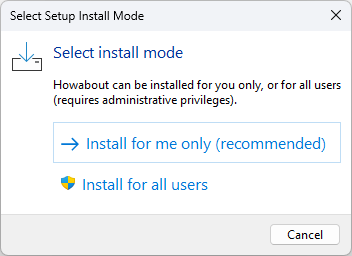
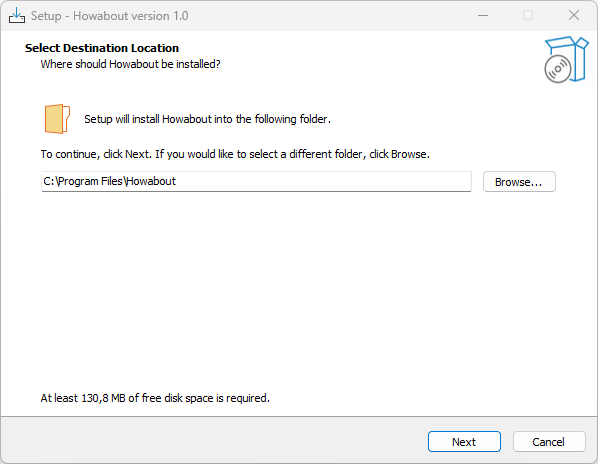
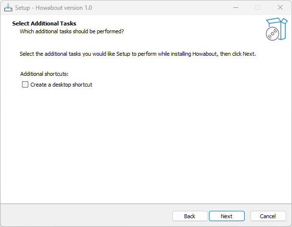
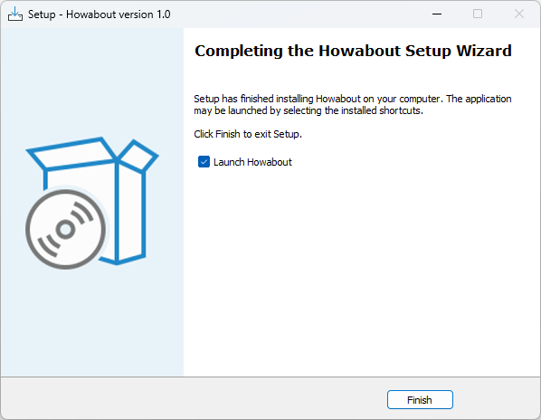

### How to install on Windows

Howabout for Windows is published on the [releases page](https://github.com/plastic-plant/howabout/releases). You'll probably want the Windows 64-bit setup for most machines, but there are also packages for older Windows 32-bit and newer Windows ARM.


#### Install with Windows installer

Works with Windows 11 and earlier versions. Download the .EXE installer and run it. The option **Install for all users** installs the files in `%SystemDrive%\Program Files\howabout\` and creates a shortcut in the Start menu. The option **Install for me only** typically install in `%AppData%\Local\Programs\Howabout`. 

- Download [howabout-1.0.0.windows-x64.exe](https://github.com/plastic-plant/howabout/releases/download/v1.0.0/howabout-1.0.0.windows-x64.exe) as Setup package for Windows 64-bit.

- Download [howabout-1.0.0.windows-x86.exe](https://github.com/plastic-plant/howabout/releases/download/v1.0.0/howabout-1.0.0.windows-x86.exe) as Setup package for Windows 32-bit.







#### Install as ZIP package

- Download [howabout-1.0.0.windows-x64.zip](https://github.com/plastic-plant/howabout/releases/download/v1.0.0/howabout-1.0.0.windows-x64.zip) as .zip for Windows 64-bit.
- Download [howabout-1.0.0.windows-x86.zip](https://github.com/plastic-plant/howabout/releases/download/v1.0.0/) as .zip for Windows 32-bit.
- Download [howabout-1.0.0.windows-arm64.zip](https://github.com/plastic-plant/howabout/releases/download/v1.0.0/howabout-1.0.0.windows-arm64.zip) as .zip for Windows ARM64.

You can then run the executable from command line.

```bash
howabout help
howabout setup
```
